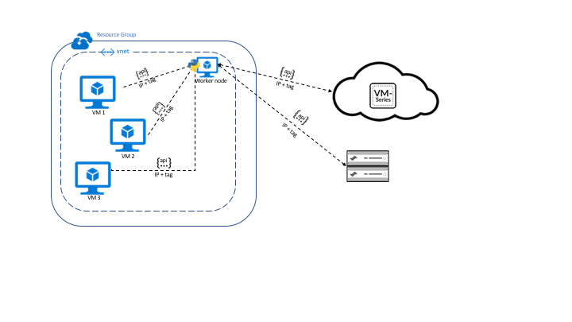

# azure-vm-monitoring

# Introduction
The dynamic nature of cloud environments means security also needs to be dynamic. Palo Alto Networks firewalls allow you to define dynamic address groups that can be programmatically updated, using the PAN-OS API, to reflect the changes in your cloud environment.
The VM Monitoring solution on Azure enables you to collect IP address and tag information from virtual machines and register them on the firewall. You can then use this IP address and tag information in dynamic address groups to create security policies that adapt to changes in your Azure environment.  As workloads are added or removed from the Azure Resource Group, the members of this group are automatically updated and Security policy accommodates these changes to ensure that you have a robust, repeatable process. This automation is key in keeping up with the pace of change in the cloud environment.

When defining Security policies to secure assets deployed on Azure, craft  policies in a logical way. For example: Allow traffic from web servers running Linux to database servers running Windows. (this seems like a fragmented sentence no?)

# The solution

The published solution uses a script that can be run on a worker node (Linux virtual machine) within an Azure VNet to collect tags and associated IP addresses of VMs from specified Azure resource groups and register the information to one or more firewalls.

# Support Policy  
## Supported

This solution is released under the official support policy of Palo Alto Networks through the support 
options that you've purchased, for example Premium Support, support teams, or ASC (Authorized Support Centers) partners 
and Premium Partner Support options. The support scope is restricted to troubleshooting for the stated/intended use 
cases and product versions specified in the project documentation and does not cover customization of the scripts or templates. 

Only projects explicitly tagged with "Supported" information are officially supported. 
Unless explicitly tagged, all projects or work posted in our [GitHub repository](https://github.com/PaloAltoNetworks) or sites 
other than our official [Downloads page](https://support.paloaltonetworks.com/) are provided under the best effort policy.

# Documentation
* Release Notes: Included in this repository
* Technical Documentation: [VM Monitoring on Azure](https://www.paloaltonetworks.com/documentation/81/virtualization/virtualization/set-up-the-vm-series-firewall-on-azure/vm-monitoring-on-azure.html)
* More templates: [Palo Alto Networks Live Community](https://live.paloaltonetworks.com/t5/Cloud-Integration/ct-p/Cloud_Templates)
* About the [VM-Series Firewall for Azure](https://azure.paloaltonetworks.com).
